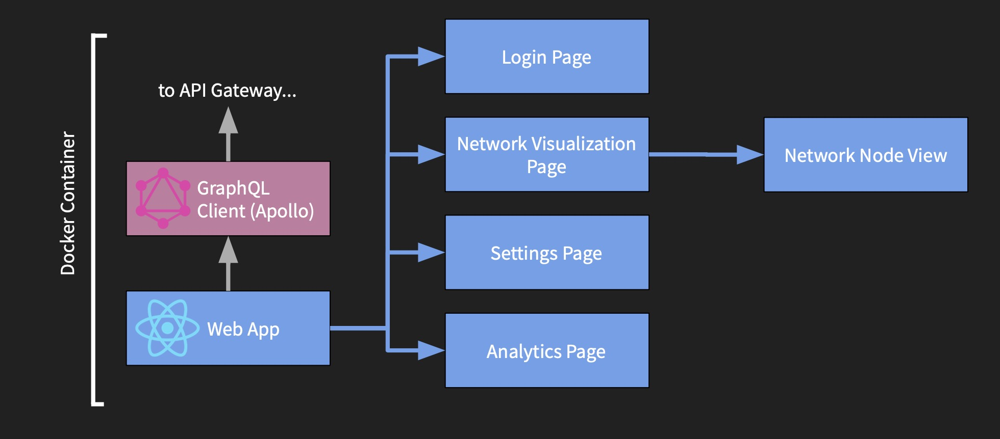
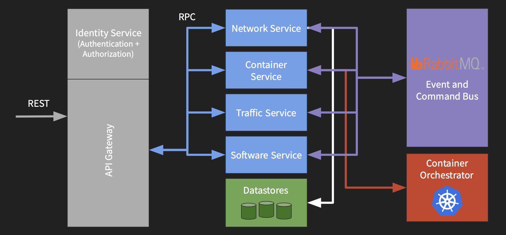

# User Stories and Design Diagrams

## User Stories

1. As a teacher, I want to create virtual networks on my own hardware, so that I can teach basic networking concepts.

2. As a teacher, I want to create isolated testing environments, so that I can teach basic security principles.

3. As a network administrator, I want to let teachers and students securely interact with these virtual networks in isolation, so that I don’t have to reconfigure our physical network.

4. As a student, I want to analyze and visualize TCP/IP/Ethernet/MAC traffic between virtual computers, so I can learn how computers communicate in a network.

5. As a student, I want to create virtual devices that can communicate from different virtual networks, so I can learn how Internet routing works.

6. As a student, I want to access a safe environment where I can test malware, so I can see how the malware works without harming my own computer.

7. As a student, I want to access a safe environment where I can test malware, so I can see how the malware works without harming my own computer.

8. As a teacher, I want to ask a student to setup a webserver on an unconfigured virtual machine, so that I can test their understanding of network configurations.

## Design Diagrams

### Front-end Design

For the front end, we are creating a single page web app written in [React](https://reactjs.org). The layout of our app will consist of four main pages: the Login page, Network Visualization Page, Settings Page, and Analytics Page:

- From the Network Visualization Page, you can view each network node at an individual level to get more detailed information.

- The front-end will be Dockerized so it can be deployed alongside the back-end services.

- The front-end will communicate with our GraphQL backend through the Apollo Client library.

### Back-end Design

Our back-end design is services-based:

- API Gateway: The entrance into our back-end. Authentication is handled at the API Gateway.

- Network: The Network service is responsible for parsing and storing network configurations.

- Container: The Containers service is a responsible for consuming network or container configs and creating the appropriate compute nodes. This service talks to the container orchestrator to schedule and run ‘machines’ that the users configure. Each ‘machine’ is actually just a container running on Kubernetes.

- Traffic: The Traffic service will aggregate network traffic information and present a standard way to query it.

- Software: The Software service is responsible for maintaining the set of images available to the system.

- Message Bus: a RabbitMQ instance to send events and commands service-to-service (ensures at-least-once delivery)
Backing store: a PostgreSQL instance and MongoDB instance to store user and service data.

All services will run as Docker containers in a simple Docker Compose file.

[Previous Page](02-project-description.md) | [Next Page](04-project-tasks-and-timeline.md)
