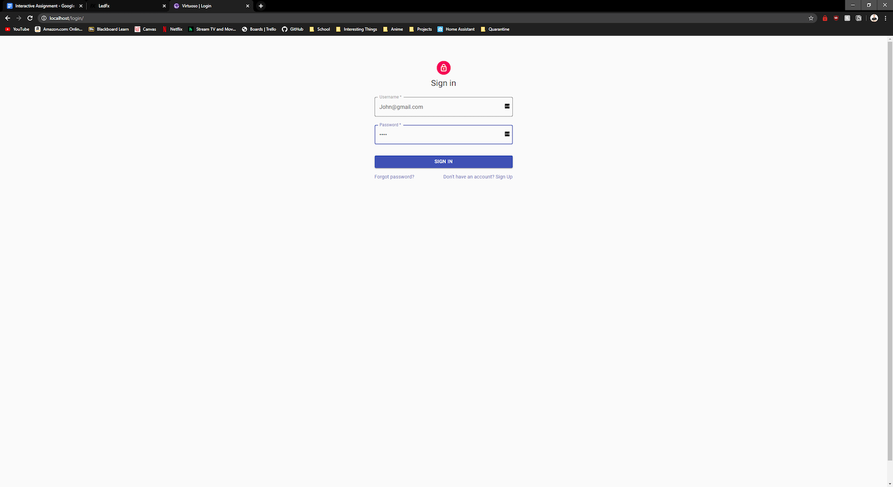
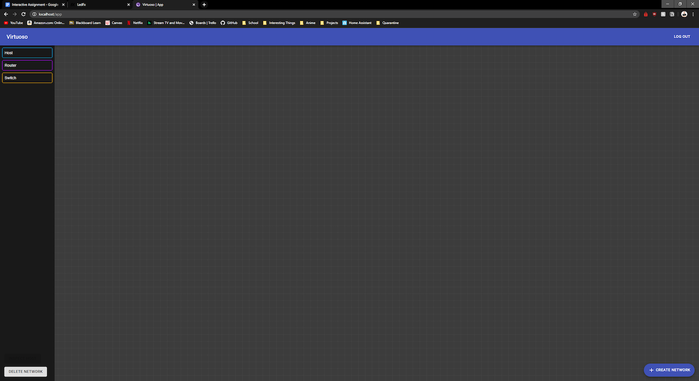
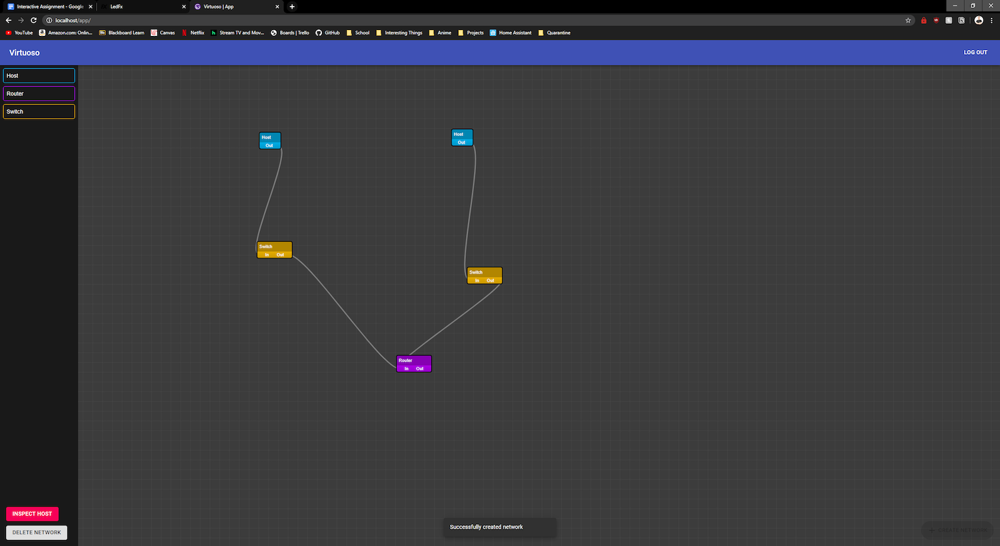
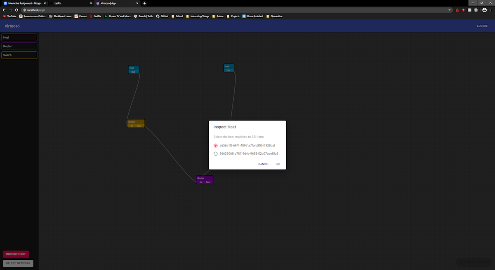
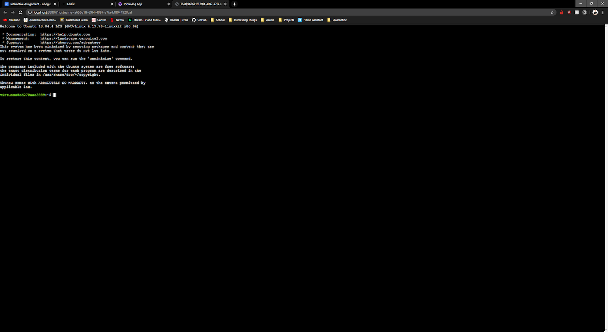

# User Manual

A quick start guide for getting up and running with Virtuoso.

## Contents

- [Installation Guide](#installation-guide)
- [Usage Guide](#usage-guide)
- [FAQ](#faq)

## Installation Guide

Before installing Virtuoso on your machine or server, you'll need some basic requirements installed:

- [Docker](https://www.docker.com/products/docker-desktop)
    - [For Linux](https://docs.docker.com/engine/install/ubuntu/)
    - [For macOS](https://hub.docker.com/editions/community/docker-ce-desktop-mac)
    - Or [for Windows](https://hub.docker.com/editions/community/docker-ce-desktop-windows)
- [Git](https://git-scm.com/downloads)

With those installed, clone the repository (with submodules) with Git:

```sh
$ git clone --recurse-submodules git://github.com/Samwisebuze/senior-design.git virtuoso
$ cd virtuoso
```

Next, start Docker. On macOS and Windows, this entails starting the Docker application. On Linux, this entails starting the Docker daemon. More information can be found [here on the Docker documentation website]().

Then, once Docker is running, quickly test that Docker is working:

```sh
$ docker --version
Docker version 19.03.8, build afacb8b
```

For the next step, you'll need `docker-compose`. `docker-compose` comes installed on macOS and Windows. If you're on Linux, you'll also have to install `docker-compose`. [Instructions to do so can be found on the Docker documentation website](https://docs.docker.com/compose/install/) or below:

```sh
# For Linux only:
$ sudo curl -L "https://github.com/docker/compose/releases/download/1.25.5/docker-compose-$(uname -s)-$(uname -m)" -o /usr/local/bin/docker-compose
$ sudo chmod +x /usr/local/bin/docker-compose
```

Next, quickly test that `docker-compose` is working as expected:

```sh
$ docker-compose --version
docker-compose version 1.25.4, build 8d51620a
```

Now build the Virtuoso project:

```sh
$ docker-compose build
# this could take a while. get some coffee and come back.
```

And run Virtuoso:

```sh
$ docker-compose up
# open http://localhost/
```

Open [http://localhost/](http://localhost/) in your web browser to see the front-end user interface.

## Usage Guide

To get started with the Virtuoso interface, open [http://localhost/login/](http://localhost/login/) in your web browser. You'll need to login to continue. If you don't have an account, click the Sign Up link.



Once you're signed in, you're presented with a blank canvas. Drag and drop items from the left sidebar onto the canvas to start building your own network. Drag and drop between nodes to link them together however you like:



Once your happy with your network setup, click the Create Network button in the bottom right. Your new network is now created!



To get full SSH access into a host node, click Inspect Host in the bottom left. Then, choose which host you want to connect to and click Go:



A new window will appear with full SSH access over inside your web browser:



To exit the SSH session and return to the Virtuoso dashboard, just close the window.

From here, you can access other nodes with the Inspect Host button, or click Delete Network to create a new network.

## FAQ

### I made a change to the Virtuoso code, how to I run the changes?

Use:

```sh
# stop Virtuoso with ctrl+c if it is running
$ docker-compose up --build
# this could take a few minutes
# open http://localhost/ to see changes
```

To rebuild and run Virtuoso

### How do I update Virtuoso?

Use:

```sh
# stop Virtuoso with ctrl+c if it is running
$ git fetch --all
$ git pull origin staging
$ docker-compose up --build
# this could take a few minutes
# open http://localhost/ to see changes
```

### How do I run Virtuoso as a daemon?

```
$ docker-compose up -d
# open http://localhost/
```

### How do I run Virtuoso as a server?

Ensure the following ports are exposed for incoming traffic to Virtuoso:

```
80, 4000, 5000, 8080, and 8888
```

Then, run Virtuoso as normal:

```sh
$ docker-compose up -d
```

---

[⭠ Previous Page](03-test-plans.md) | [Next Page ⭢](05-ppt-presentation.md)
